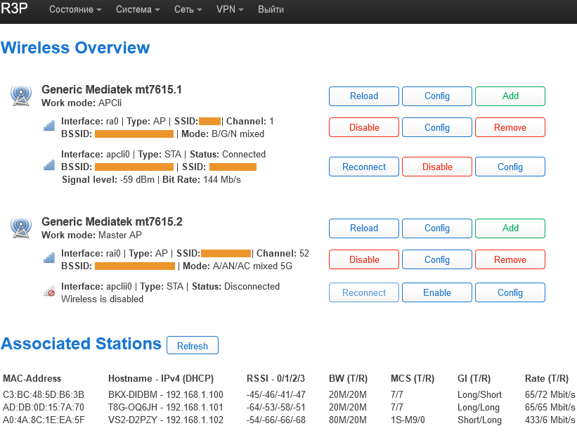

# MTK Wi-Fi driver for OpenWrt 22.03.5
#### For Xiaomi Mi R3P and devices using:
- MT7615+MT7615  
- MT7603+MT7615  
- MT7603+MT7612  
---
```diff
- I no longer plan to release updates for new versions of OpenWrt (22.03.5 is the latest version).
- Я больше не планирую выпускать обновления для новых версий OpenWrt (22.03.5 - последняя версия).
```
---
### [Инструкция по сборке (in Russian)](README_RU.md)

### Screenshot ([All](screenshots))


### Sources
https://github.com/openwrt/openwrt  
https://github.com/coolsnowwolf/lede  
https://github.com/immortalwrt/immortalwrt  
https://github.com/Nossiac/mtk-openwrt-feeds  
